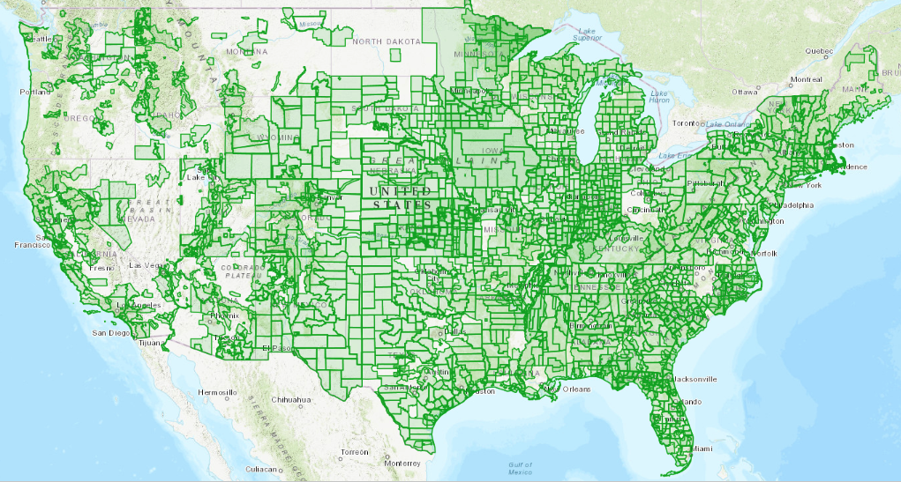
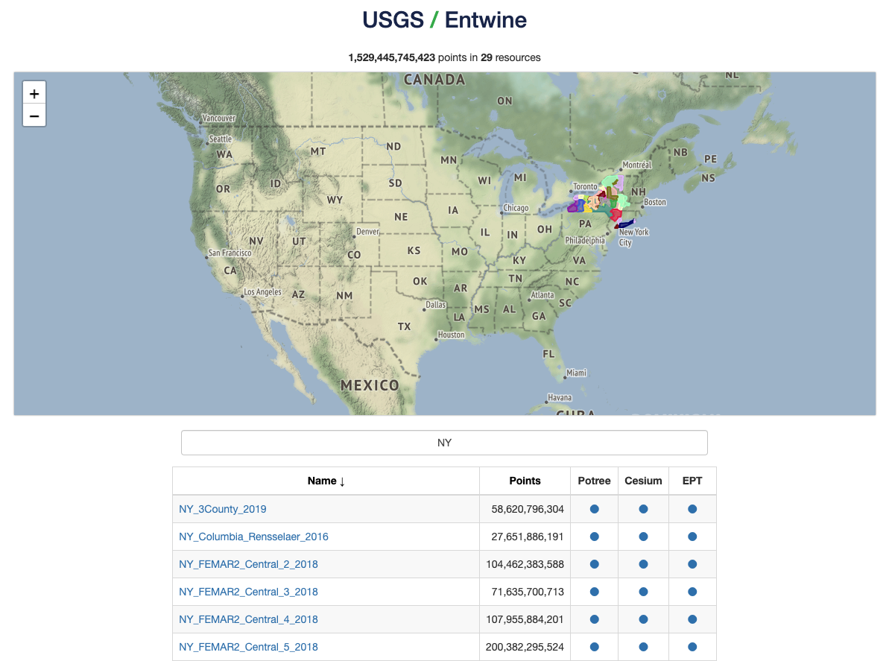
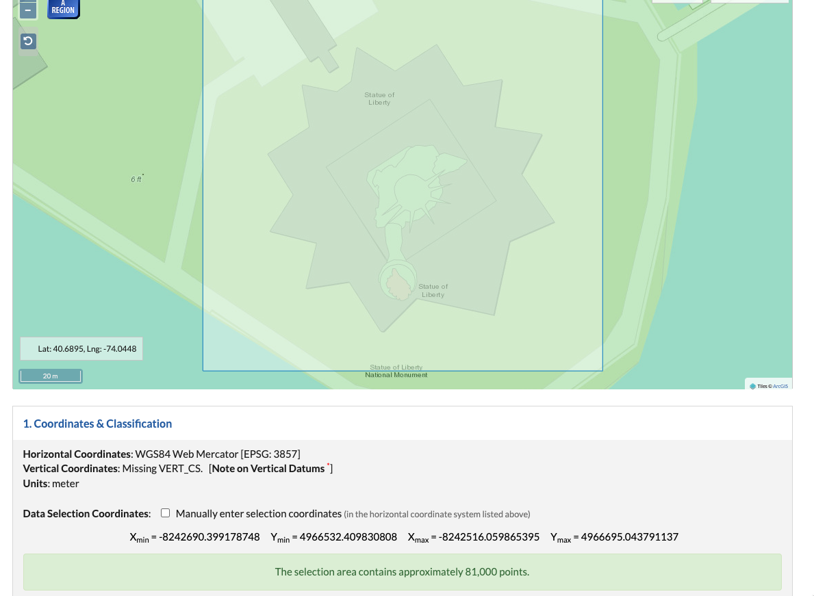
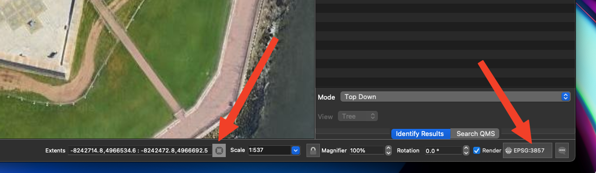
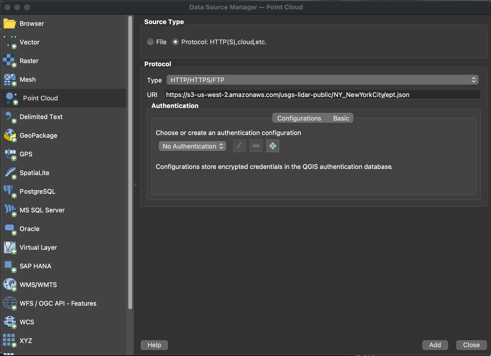
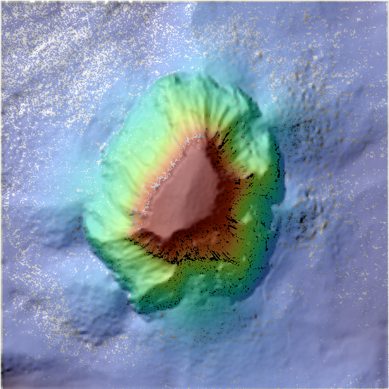

# Table of Contents
1. [Introduction](#intro)
2. [EPT Data Access](#access)
3. [QGIS with Entwine](#qgis)
4. [Integrating 3DEP](#integrate)
5. [Exercises](#exercises)

# Introduction <a name ="intro"></a>

## USGS 3DEP program


- The U.S. Geological Survey’s (USGS) 3D Elevation Program (3DEP) is an ambitious effort to complete acquisition of nationwide lidar (IfSAR in AK) by 2023 to provide the first-ever national baseline of consistent high-resolution elevation data.  USGS migrated these data into the cloud, led by [HOBU](https://hobu.co/), Inc. and the U.S Army Corps of Engineers (USACE) Cold Regions Research and Engineering Laboratory (CRREL) in collaboration with [AWS Public Dataset Program](https://aws.amazon.com/opendata/?wwps-cards.sort-by=item.additionalFields.sortDate&wwps-cards.sort-order=desc).  As part of this effort the 3DEP data were standardized and written out to a [publicly-accessible, free AWS bucket in the entwine format](https://registry.opendata.aws/usgs-lidar/).

## Entwine


- [Entwine](https://entwine.io/en/latest/index.html) is open source software from [HOBU, Inc.](https://hobu.co/) that organizes massive point cloud collections into streamable data services.  Entwine builds are completely lossless, so no points, metadata, or precision will be discarded even for terabyte-scale datasets.  The output format produced by entwine is the [Entwine Point Tile (EPT)](https://entwine.io/en/latest/entwine-point-tile.html), which is a simple and flexible octree-based storage format for point cloud data.  This format enables better performance when dealing with web map applications, or cloud computing with large point cloud datasets.


# EPT Data Access <a name ="access"></a>


- PDAL provides an [entwine reader](https://pdal.io/en/2.5.3/stages/readers.ept.html#readers-ept) that can easily read the USGS 3DEP data in EPT format. With a simple pipeline, it is fairly straightforward to subset the data from the AWS entwine bucket for a given dataset.  

- For example, to grab USGS 3DEP lidar data of the Statue of Liberty:

```
{
  "pipeline": [
        {
          "type": "readers.ept",
          "filename": "https://s3-us-west-2.amazonaws.com/usgs-lidar-public/NY_NewYorkCity/ept.json",
          "bounds": "([-8242666.7146411305, -8242531.114082908], [4966542.613156153, 4966683.155298185])"
	},
      "./data/StatueLiberty.laz"
  ]
}


```

## Dataset Names
- One of the trickier parts to working with these datasets is actually knowing the name of the dataset. There are a couple of ways of determining this:
   1.  Use the [USGS Entwine site](https://usgs.entwine.io/).  There is a search box to help subset the datasets, as well as access to cesium and potree web visualizations of the datasets.



   2. Using [AWS CLI tools](https://aws.amazon.com/cli/), you can can a listing of the datasets from the command line by doing:
   ```
   aws s3 ls --no-sign-request s3://usgs-lidar-public/
   ```

   3. Use [OpenTopography](https://portal.opentopography.org/dataCatalog?group=usgs) to get a listing. **Note** we remove the underscores from the names, so these need to be re-added to the EPT URL in the pipeline.
   
   4. The USGS has been migrating the metadata to AWS.  There is a [listing of 3DEP projects](http://prdtnm.s3.amazonaws.com/index.html?prefix=StagedProducts/Elevation/LPC/Projects/), but use caution.  Technically, the entwine AWS bucket is a separate project, and the processing schedule may be different than the "user-pays" bucket.  This can result in data existing in one bucket, but not the other.  Also, on rare occasions, there could be discrepancies in dataset naming conventions that can cause issues.  However, overall it is a good resource to find out more about each of the datasets.
   
## Dataset Bounds
- As part of the conversion of the USGS 3DEP data to the entwine format, HOBU took steps to standardize the datasets. All data had their horizontal coordinate reference system (CRS) converted to web mercator ([EPSG:3857](https://epsg.io/3857)).  Vertical coordinate systems were converted to meters, but were not transformed and were left in their original vertical CRS.  This can sometimes lead to confusion as metadata for some datasets will report units in feet, but the entwine datasets have been converted to meters.

- Because of the size of the 3DEP datasets, and the fact that these are cloud-based resources, it is necessary to subset the data.  The easiest way to do this is with the "bounds" parameter to the [entwine reader](https://pdal.io/en/2.5.3/stages/readers.ept.html#readers-ept).  The bounds are expressed as a string, e.g.: ([xmin, xmax], [ymin, ymax], [zmin, zmax]). If omitted, the entire dataset will be selected. 

- It is probably not obvious to most users what the web-mercator coordinates are for a given area of interest. There are many hacks to get around this, here are a couple:
   1.  Use [OpenTopography](https://portal.opentopography.org/dataCatalog?group=usgs). Even if you don't want to run the job through OpenTopo, you can select an area, and get the web mercator bounds that can then be used in a custom, local pipeline:
   
   2. Use QGIS with a basemap. Open Web --> Quick Map Services --> Search QMS.  In the search dialog, enter "google" or "bing" to search for a favorite basemap. Change the basemap projection to Web Mercator by clicking the buttin in the lower-right of the application, and set it to EPSG:3857.  Toggle the mouse position display, and it will show the extent of the map in Web Mercator coordinates.  Copy and paste these coordinates into your pipeline.  **Note** QGIS outputs the coordinates in [xmin,ymin],[xmax,ymax] which is a different convention than the PDAL bounds option, so use caution when pasting the coordinates.
   
   3. The "bounds" parameter for [entwine reader](https://pdal.io/en/2.5.3/stages/readers.ept.html#readers-ept) can be followed by a slash (‘/’) and a spatial reference specification to apply to the bounds. In this manner, users can specify a more memorable coordinate system such as lat/lon values to subset the data.  For example, the pipeline below uses lat/lon coordinates ([EPSG:4326])(https://epsg.io/4326) to subset the ept resource that is in Web Mercator:

    ```
    {
      "pipeline": [
          {
           "type": "readers.ept",
           "filename":"https://s3-us-west-2.amazonaws.com/usgs-lidar-public/NY_NewYorkCity/ept.json",
           "bounds": "([-74.045473, -74.04364], [40.68867,40.689866])/EPSG:4326"
          },
          "./data/StatueLiberty_4326Search.laz"]
    }

    ```

## EPT Filename Convention
- URLS to the EPT resource can also be witten in an alternate format:
```
{
  "pipeline": [
        {
          "type": "readers.ept",
          "filename": "ept://https://s3-us-west-2.amazonaws.com/usgs-lidar-public/NY_NewYorkCity",
          "bounds": "([-8242666.7146411305, -8242531.114082908], [4966542.613156153, 4966683.155298185])"
	},
      "./data/StatueLiberty.laz"
  ]
}
```

# QGIS with Entwine <a name ="qgis"></a>
- As of version 3.2 QGIS has the ability to visualize the 3DEP entwine resources directly. Open the Data Source Manager, select Point Cloud from the list on the left and then the Protocol selection under Source Type. Enter the address of the ept.json file as the URI under Protocol:



# Integrating 3DEP <a name ="integrate"></a>
- Based on the basic PDAL tutorials, we can apply additional processing stages to any of the datasets from the USGS 3DEP collection

The following pipeline does the following:
- Extract data over Devil's Tower Wyoming from the AWS enwtine bucket
- Reproject the data from the default Web Mercator to UTM Zone 13N
- Filter the data to just use ground-classified points
- Write out a ground-classified LAZ file
- Additionally write out a 2m DTM.

```
from ./pipelines/DevilsTower.json

{
  "pipeline": [
      {
          "type": "readers.ept",
          "filename": "https://s3-us-west-2.amazonaws.com/usgs-lidar-public/WY_FEMA_East_B3_2019/ept.json",
          "bounds": "([-11657141., -11656509.],[5556970.,5557606. ])"
      },
      {
          "type":"filters.reprojection",
          "in_srs":"EPSG:3857+5703",
          "out_srs":"EPSG:32613+5703"
      },
      {
          "type": "filters.range",
          "limits": "Classification[2:2]"
      },
      {
          "type" : "writers.las",
          "filename": "./data/DevilsTower_Ground.laz",
          "compression": "laszip",
          "a_srs": "EPSG:32613+5703"
      },
      {
          "filename":"./data/DevilsTower_Ground.tif",
          "gdaldriver":"GTiff",
          "output_type":"min",
          "resolution":"2.0",
          "type": "writers.gdal"
      }	      
  ]
}
```

- Loading the data into QGIS, here is the point cloud colored by elevation overlaid on a hillshade visualization of the DTM: 


# Exercises <a name ="exercises"></a>
- Try to download data directly from the AWS entwine bucket for an area of your choice. Experiment with building your own pipelines. 
- If possible, work through the [OpenTopography notebook: 01_3DEP_Generate_DEM_User_AOI.ipynb](https://github.com/OpenTopography/OT_3DEP_Workflows/blob/main/notebooks/01_3DEP_Generate_DEM_User_AOI.ipynb) to generate a DEM from the USGS 3DEP data.