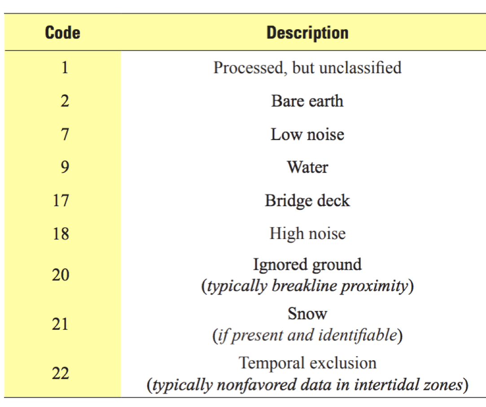

# Table of Contents
1. [Background](#background)
2. [Working with PDAL](#work)
3. [PDAL mechanics](#mechanics)
4. [Inspecting Files](#inspect)
5. [Classifications](#classifications)
6. [Exercises](#exercises)


# Background info on PDAL. <a name ="background"></a>


- [PDAL - Point Data Abstraction Library](https://pdal.io/en/latest/) is one of the few open source tools to work with point cloud data
- LAStools is partially free & open source, but advanced usage requires a license.
- PDAL also utilizes and aligns nicely with other open source tools such as [GDAL](https://gdal.org/index.html) and [PROJ](https://proj.org/).
- Alignment with PROJ results in standardized coordinate system metadata


# Ways of working with PDAL <a name ="work"></a>
There are a couple of different pathways to working with PDAL: CLI, PDAL docker containers and PDAL Python API. For this workshop we will utilize the command line PDAL.

## CLI
- simplified syntax as compared to dockerized version.


```
pdal --version
pdal info --metadata ./data/OR_WizardIsland.laz
```

- Can pipe in bash commands when working with large sets of files
```
for f in *.laz;do pdal info $f --metadata >> output.txt;done
```

## Dockerized PDAL
Useful if you want to avoid OS-specific issues.  Also useful to easily work with different versions of the software: https://hub.docker.com/r/pdal/pdal/tags

```
docker pull pdal/pdal
docker run pdal/pdal pdal --version
docker run -v $PWD/data/:/data pdal/pdal pdal info --metadata /data/OR_WizardIsland.laz
```

Command Breakdown:
- "docker run" - starts the PDAL container.  Need to run everytime a PDAL command is issued 
- "-v" maps the drives. Local drives need to be mapped to a location in the container.  Multiple volumes can be mapped.
- pdal/pdal is the name of the PDAL container.  You can download an image for a specific version, in which case the command would be something like: pdal/pdal:2.5.3
- "pdal info --metadata /data/OR_WizardIsland.laz" is the actual PDAL command.  Note the path to dataset is the path to the mounted volume in the docker container, and NOT on your local machine.

- pros/cons to using Docker.  For simple workflows at the command line, commands can get long and tedious.


## PDAL Python API
- Useful to integrate with existing python code.  Note it requires a conda install:

```
conda install -c conda-forge python-pdal
```

- Check out the excellent [python API notebook example](https://github.com/adamsteer/f4g-oceania-pdal/blob/master/notebooks/PDAL-python.ipynb) by Dr. Adam Steer for use cases and how to integrate PDAL into your python scripts via the API.

- Sample PDAL Python API commands:
```
import pdal
pipeline = pdal.Pipeline(json.dumps(pipelineJson))
pipeline.validate() # check if our JSON and options were good
count = pipeline.execute() # run the pipeline
```

- Could also integrate calls to PDAL from within python scripts by using the [subprocess module](https://docs.python.org/3/library/subprocess.html)

- For example, here is python pseudocode to loop over a series of LAZ files and output the metadata to a text file
```
import subprocess
from subprocess import PIPE

out_meta = "output_metadata.txt"
for i,f in enumerate(files):
    cmd2 = ['pdal info \"'+f+'\" --metadata >> '+out_meta]
      p2 = subprocess.run(cmd2,shell=True,stderr=subprocess.PIPE)
```


# PDAL mechanics <a name ="mechanics"></a>

## Command line commands vs pipelines.  
- PDAL commands can be issued at the command line with a variety of options

- e.g. Convert a LAZ file to a LAS file in version 1.2:
```
pdal translate --writers.las.minor_version=2 input.laz output_v12.las
```

- e.g. Reproject a file from geographic coordinates (lat/lon) to UTM-based coordinates:
```
pdal translate input_4326.laz output_UTM10N.laz reprojection --filters.reprojection.out_srs="EPSG:32610"
```

- Once commands and workflows get excessively long or complicated, it probably makes sense to start utilizing pipelines.


## Concept of Pipelines.
- PDAL utilizes a JSON input file called a "pipeline" that can execute a series of commands
- Pipelines are useful when building complex workflows.  Each section of the pipeline is called a "stage", and the output of one "stage" will be the input of the following "stage".
- Stages will mostly consist of a reader, writer, or filter operation.

- Here is a simple reprojection operation, but we want to utilize some of the extra optional parameters, so the command would be quite cumbersome to do via a single command line call.  Here we have 3 "stages": a reader, reprojection, and writer stage: 
```
{
    "pipeline": [{"type" : "readers.las",
                  "filename": "input.las"
                 },
                 {"type":"filters.reprojection",
                  "in_srs":"EPSG:26910+5703",
                  "out_srs":"EPSG:6339+5703"
                 },
                 {"type" : "writers.las",
                  "filename": "output.laz",
                  "compression": "laszip",
                  "a_srs": "EPSG:6339+5703"
                 }
                 ]}
```

- each stage or operation will have its own set of options that you can customize. For example, go to [Writers.las documentation](https://pdal.io/en/2.5.3/stages/writers.las.html) to see what options are available when writing out a LAS/LAZ file.

- Pipelines are JSON files that are written out to separate files.  To call the pipeline, specify the [pipeline](https://pdal.io/en/2.5.3/pipeline.html#) command to read in the JSON pipeline and executes the commands:

```
>> pdal pipeline ./pipeline/pipeline_example.json
```


### Processing Modes
- PDAL has two modes of data processing: standard or stream mode.  In standard mode all input is read into memory before it is processed.  This is often necessary for operations that need access to all of the points at a given time (e.g. sorting).
- Stream mode processes data as it is read in chunks, as is much less memory-intensive.
- When using multi-stage pipelines with large datasets, there is the possibility of out-of-memory issues, especially if some of the operations require standard mode.  In these cases, it may be adviseable to break the pipeline into multiple pipelines.


# Inspecting a file <a name ="inspect"></a>
- PDAL's [info application](https://pdal.io/en/2.4.3/apps/info.html) is very powerful, and has a lot of options to help interrogate a dataset
```
pdal info ./data/FoxIsland.laz --metadata
pdal info ./data/FoxIsland.laz --schema
pdal info ./data/FoxIsland.laz --summary
pdal info ./data/FoxIsland.laz --stats
```

## Metadata
Use the [info application](https://pdal.io/en/2.4.3/apps/info.html) to get basic info about a file. Using the "--metadata" flag will print out the metadata from the header.

```
pdal info --metadata ./data/OR_WizardIsland.laz

{
  "file_size": 27167488,
  "filename": "/Users/beckley/Documents/OT/meetings/RCN_May2023/notebook/data/OR_WizardIsland.laz",
  "metadata":
  {
    "comp_spatialreference": "PROJCS[\"NAD83 / Oregon GIC Lambert (ft)\",GEOGCS[\"NAD83\",DATUM[\"North_American_Datum_1983\",SPHEROID[\"GRS 1980\",6378137,298.257222101,AUTHORITY[\"EPSG\",\"7019\"]],AUTHORITY[\"EPSG\",\"6269\"]],PRIMEM[\"Greenwich\",0,AUTHORITY[\"EPSG\",\"8901\"]],UNIT[\"degree\",0.0174532925199433,AUTHORITY[\"EPSG\",\"9122\"]],AUTHORITY[\"EPSG\",\"4269\"]],PROJECTION[\"Lambert_Conformal_Conic_2SP\"],PARAMETER[\"latitude_of_origin\",41.75],PARAMETER[\"central_meridian\",-120.5],PARAMETER[\"standard_parallel_1\",43],PARAMETER[\"standard_parallel_2\",45.5],PARAMETER[\"false_easting\",1312335.958],PARAMETER[\"false_northing\",0],UNIT[\"foot\",0.3048,AUTHORITY[\"EPSG\",\"9002\"]],AXIS[\"Easting\",EAST],AXIS[\"Northing\",NORTH],AUTHORITY[\"EPSG\",\"2992\"]]",
    "compressed": true,
    "copc": false,
    "count": 5878047,
    "creation_doy": 107,
    "creation_year": 2023,
    "dataformat_id": 1,
    "dataoffset": 1284,
    "filesource_id": 0,
    "global_encoding": 0,
    "global_encoding_base64": "AAA=",
    "gtiff": "Geotiff_Information:\n   Version: 1\n   Key_Revision: 1.0\n   Tagged_Information:\n      End_Of_Tags.\n   Keyed_Information:\n      GTModelTypeGeoKey (Short,1): ModelTypeProjected\n      GTRasterTypeGeoKey (Short,1): RasterPixelIsArea\n      GTCitationGeoKey (Ascii,28): \"NAD83 / Oregon Lambert (ft)\"\n      GeogCitationGeoKey (Ascii,6): \"NAD83\"\n      GeogAngularUnitsGeoKey (Short,1): Angular_Degree\n      ProjectedCSTypeGeoKey (Short,1): Code-2992 (NAD83 / Oregon GIC Lambert (ft))\n      ProjLinearUnitsGeoKey (Short,1): Linear_Foot\n      End_Of_Keys.\n   End_Of_Geotiff.\n",
    "header_size": 227,
    "major_version": 1,
    "maxx": 873448.1,
    "maxy": 438854.95,
    "maxz": 6960.01,
    "minor_version": 2,
    "minx": 870920.41,
    "miny": 436914.9,
    "minz": 6172.44,
    "offset_x": 0,
    "offset_y": 0,
    "offset_z": 0,
    "point_length": 28,
    "project_id": "00000000-0000-0000-0000-000000000000",
    "scale_x": 0.01,
    "scale_y": 0.01,
    "scale_z": 0.01,
    "software_id": "las2las (version 120813) + OT",
    ...
```

- This command is useful to get some basic metadata:
    - Coordinate system of the dataset
    - Point counts
    - min/max of XYZ values
    
- The scale_x, scale_y, and scale_z help determine the precision of the data. LAS stores XYZ values as 32-bit integers, and then applies the scale values to obtain the appropriate precision.  If these parameters are set to an unrealistic value, it could create unnecessarily large files when converting from LAS to LAZ (see article on [LASzip](https://www.cs.unc.edu/~isenburg/lastools/download/laszip.pdf))

## Schema
- Use the [info application](https://pdal.io/en/2.4.3/apps/info.html) with the **--schema** flag to obtain the schema for a given dataset:

```
pdal info --schema ./data/FoxIsland.laz

{
  {
  "file_size": 18337307,
  "filename": "./data/FoxIsland.laz",
  "now": "2023-04-28T12:03:38-0600",
  "pdal_version": "2.5.3 (git-version: Release)",
  "reader": "readers.las",
  "schema":
  {
    "dimensions":
    [
      {
        "name": "X",
        "size": 8,
        "type": "floating"
      },
      {
        "name": "Y",
        "size": 8,
        "type": "floating"
      },
      {
        "name": "Z",
        "size": 8,
        "type": "floating"
      },
      ...
```

## Printing Points 
Use the [info application](https://pdal.io/en/2.4.3/apps/info.html) to get basic info about a file.  Utilizing the -p option lets the user print out a specific point from the file

```
pdal info ./data/FoxIsland.laz -p 0

{
  "file_size": 18337307,
  "filename": "./data/FoxIsland.laz",
  "now": "2023-05-04T12:58:26-0600",
  "pdal_version": "2.5.3 (git-version: Release)",
  "points":
  {
    "point":
    {
      "Blue": 0,
      "Classification": 1,
      "EdgeOfFlightLine": 0,
      "GpsTime": 270593867.2,
      "Green": 0,
      "Intensity": 47688,
      "NumberOfReturns": 3,
      "PointId": 0,
      "PointSourceId": 59,
      "Red": 0,
      "ReturnNumber": 3,
      "ScanAngleRank": -8,
      "ScanDirectionFlag": 0,
      "UserData": 0,
      "X": 527495.82,
      "Y": 5233371.48,
      "Z": 44.04
    }
  },
  "reader": "readers.las"
}


```

- Combining PDAL with bash commands to extract just the first 10 elevation points:

```
pdal info ./data/FoxIsland.laz -p 0-10|grep  "Z"|awk '{print $2}' FS=': '
```

- jq is a command line JSON parser, and can be a useful tool for these types of operations. Note if returning more than one point, specify "[]" to return all the points in the array.:

```
pdal info ./data/FoxIsland.laz -p 0-10|jq -r .points.point[].Z
```

## Attribute Statistics.
Use the [info application](https://pdal.io/en/2.4.3/apps/info.html) with the --stats flag and perform filtering to get a summary of a given attribute for a given lidar file. For example to get a list of all the point classifications and their counts:

```
pdal info ./data/FoxIsland.laz --stats --filters.stats.dimensions=Classification 
   --filters.stats.count=Classification
{
  "file_size": 18337307,
  "filename": "./data/FoxIsland.laz",
  "now": "2023-04-28T14:46:01-0600",
  "pdal_version": "2.5.3 (git-version: Release)",
  "reader": "readers.las",
  "stats":
  {
    "statistic":
    [
      {
        "average": 5.633072822,
        "count": 3100062,
        "counts":
        [
          "1.000000/2524244",
          "2.000000/474803",
          "135.000000/69015",
          "146.000000/32000"
        ],
        "maximum": 146,
        "minimum": 1,
        "name": "Classification",
        "position": 0,
        "stddev": 24.4020614,
        "variance": 595.4606004
      }
    ]
  }
}
```

- Note the counts section displays the lidar classification and its point count per class.

# Classifications <a name ="classifications"></a>
- The [American Society for Photogrammetry and Remote Sensing](https://www.asprs.org/) has established standardized classification codes for point clouds.  Most common classifications that users encounter:
   - Ground (class=2)
   - Low/MedHigh Vegetation (class=3,4,5)
   - Water (class=9)
   - etc.
   


- Note that this is an area that is actively developed.  [Most recent developments](https://www.asprs.org/wp-content/uploads/2010/12/LAS_Domain_Profile_Description_Topo-Bathy_Lidar.pdf) have been in establishing classifications codes for topo-bathymetric datasets:
   - objects suspended in water column
   - objects at bottom of water column
   - etc.

# Exercises <a name ="exercises"></a>
- Inspect the laz files in the ./data directory or download a small dataset of your own from [OpenTopography](https://opentopography.org/)
- Determine the coordinate system, and classifications present in the data
- How many returns are there for your dataset?  How many first returns? (hint:use method to get information on Classifications, except replace "Classification" with variable for the Return Number.  Not sure what the "Return Number" variable name is? Use the schema option to find out)


    


 


