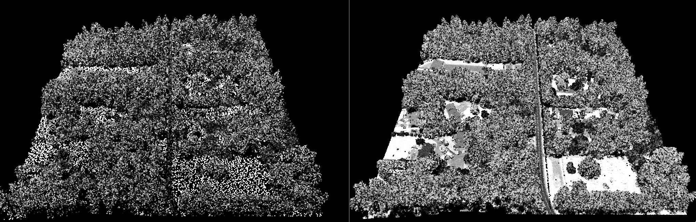
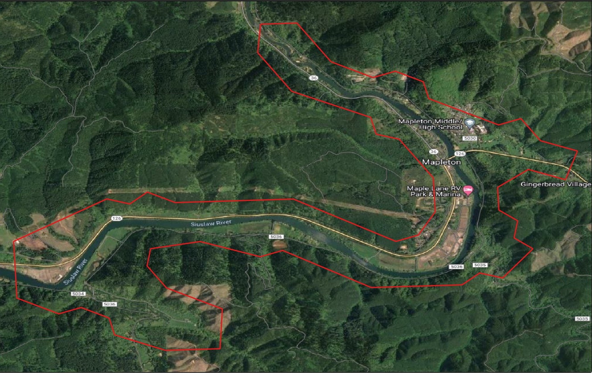
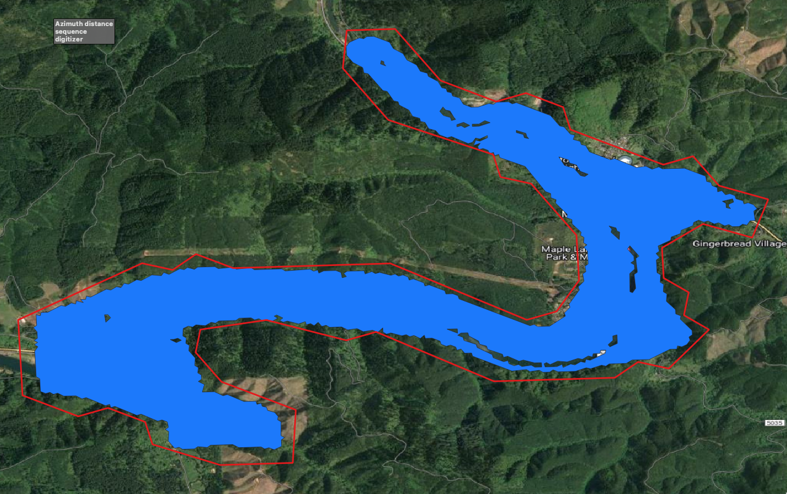

# Table of Contents
1. [File I/O](#fileIO)
2. [Reprojection](#reprojection)
3. [Tiling](#tiling)
4. [Thinning](#thin) 
5. [Creating Boundaries](#boundary)
6. [Exercises](#exercises)

# File I/O <a name ="fileIO"></a>
- PDAL is often utilized to work with lidar files which are typically [LAS](https://www.asprs.org/divisions-committees/lidar-division/laser-las-file-format-exchange-activities#:~:text=The%20LAS%20file%20format%20is,x%2Cy%2Cz%20tuplet.) or LAZ formats.  However, sometimes files are provided as XYZ text.  PDAL can read/write in a variety of formats, and is useful for doing basic file I/O operations.


```
{"pipeline": [
    {
     "type":"readers.text",
     "filename":"test_xyz.csv",
     "header":"X, Y, Z",
     "skip":1
    },
    {
     "type":"filters.reprojection",
     "in_srs":"EPSG:4326",
     "out_srs":"EPSG:3857"
    },
    {
     "type" : "writers.las",
     "compression": "laszip",
     "a_srs": "EPSG:3857",
     "filename":"outfile_PDAL.laz"
    } 
    ]
}
```

- In this example pipeline we read in a CSV file that has XYZ with a single line header.  We reproject the lat/lon values to web-mercator and output a LAZ file.

- [PDAL Readers](https://pdal.io/en/2.5.3/stages/readers.html) can read a variety of common formats that may be used when working with lidar data:
    - HDF
    - EPT
    - Leica Cyclone files (*.pts, *.ptx)
    - COPC
    - etc.
    
- [PDAL Writers] can also write out a variety of formats.  Most users will usually stick with LAS/LAZ/text, but writers can also write out geoJSON format, as well as leveraging GDAL to write out raster products, which will be discussed later in the workshop


# Reprojection <a name ="reprojection"></a>
- Use the [reprojection filter](https://pdal.io/en/2.4.3/stages/filters.reprojection.html#filters-reprojection) to reproject datasets. The [translate](https://pdal.io/en/2.5.3/apps/translate.html) command can be used for simple conversion of files based on their file extensions. It can also be used for constructing pipelines directly from the command-line:

```
pdal translate ./data/FoxIsland.laz ./data/FoxIsland_4326.laz filters.reprojection --filters.reprojection.out_srs="EPSG:4326"
```

- When using more options, it makes sense to use a pipeline instead:
```
{
"pipeline": [{"type" : "readers.las",
              "filename": "./data/FoxIsland.laz"
             },
             {"type":"filters.reprojection",
              "in_srs":"EPSG:32610+5703",
              "out_srs":"EPSG:4326+5703"
             },
             {"type" : "writers.las",
              "filename": "./data/FoxIsland_4326.laz",
              "compression": "laszip",
              "forward": "header",
              "a_srs": "EPSG:4326+5703"
             }
            ]}
```

- This will reproject the data to geographic coordinates (Lat/Lon).  Putting the code for the NAVD88 datum in the EPSG code (e.g. 4326+5703) will display the vertical datum info in the metadata.

- note the a_srs controls the coordinate systm that is written to the header.  Make sure that the [EPSG code](https://epsg.io/) that is being written out in the filers.reprojection filter matches what is being set in a_srs. If there is a mismatch, the actual XY data will be in one coordinate system, but the metadata will report a different horizontal coordinate system, and this will lead to lots of errors and confusion.


## Applying a Geoid
- older versions of PDAL would be able to apply a geoid by doing the following:

```
{
    "pipeline": [{"type" : "readers.las",
                  "filename": "input_Ellipsoidal.laz"
                 },
                 {"type":"filters.reprojection",
                  "in_srs":"EPSG:32611",
                  "out_srs":"+init=EPSG:32611 +geoidgrids=g2003conus.gtx"
                 },
                 {"type" : "writers.las",
                  "filename": "output_Geoid.laz",
                  "compression": "laszip",
                  "a_srs": "EPSG:32611+5703"
                 }
		]
}
```
- Geoid GTX files can be downloaded from here: http://download.osgeo.org/proj/vdatum/
- newer versions (>= 2.5) seem to have issues with the PROJ syntax and do not appear to read the geoid grids.

- PDAL leverages PROJ for working with coordinate systems.  This results in standardized coordinate system metadata, which is not always the case with other software. 

# Tiling data<a name ="tiling"></a>
- It is often useful to tile data when working with a single large datafile to prevent out-of-memory errors.  [Filters.splitter](https://pdal.io/en/2.5.3/stages/filters.splitter.html) is a useful filter that will split a given file into tiles of a given size.  


```
{
  "pipeline": [
	{
	    "type" : "readers.las",
            "filename": "./data/FoxIsland.laz"
        },
      {
	  "type": "filters.splitter",
	  "length": "500"
      },
      {
	  "type": "writers.las",
	  "filename": "./data/tile_#.laz"
    }
  ]
}

```

- This pipeline will split up the file into tiles of 500 m length.  It will increment the filenames until all the tiles are created (i.e. tile_1.laz, tile_2.laz, etc.)
- With the new [Cloud Optimized Point Cloud (COPC)](https://copc.io/) format, tiling may not be as much of an issue because the format has an internal tiling scheme that makes it more efficient to work with.  Many COPC files are a single large file as a result.

# Thinning<a name ="thin"></a>
- Point cloud files can often be quite large and cumbersome to work with.  Depending on the objective, it is often useful to thin a dataset in order to make it easier and faster to work with. The [filters.sample](https://pdal.io/en/2.5.3/stages/filters.sample.html#filters-sample) utilizes a Poisson sampling to thin the dataset.

```
pdal translate ./data/FoxIsland_Clean.laz ./data/FoxIsland_Clean_Thin1m.laz sample --filters.sample.radius=1
```


- Left: Dataset after thinning with 1m radius.  Right: Original dataset before thinning

- Note there are a variety of other methods to decimate data via PDAL:
    - filters.decimation
    - filters.fps
    - filters.relaxationdartthrowing 
    - filters.voxelcenternearestneighbor 
    - filters.voxelcentroidnearestneighbor
    - filters.voxeldownsize
    

# Creating boundaries of data <a name ="reprojection"></a>
- Utilizing the info command, the boundary of a dataset can be obtained by simply using the "--boundary" flag.  This will output the boundary in WKT format in JSON-formatted output.

```
>> pdal info ./data/Siuslaw.laz --boundary 

{
  "boundary":
  {
    "area": 5083656.235,
    "avg_pt_per_sq_unit": 2.670004261,
    "avg_pt_spacing": 0.9299756138,
    "boundary": "POLYGON ((871585.08 436854.9,871635.22 436898.32,872562.93 436898.32,872613.07 436854.9,872863.8 436854.9,872913.95 436898.32,873465.56 436898.32,873465.56 438852.58,873390.34 438896.0,870920.64 438874.29,870908.1 436898.32,871509.86 436898.32,871585.08 436854.9))",
    "boundary_json": { "type": "Polygon", "coordinates": [ [ [ 871585.07628024998121, 436854.896951399976388 ], [ 871635.222414609976113, 436898.324777669971809 ], [ 872562.925900229951367, 436898.324777669971809 ], [ 872613.07203458994627, 436854.896951399976388 ], [ 872863.802706380025484, 436854.896951399976388 ], [ 872913.948840740020387, 436898.324777669971809 ], [ 873465.556318680057302, 436898.324777669971809 ], [ 873465.556318680057302, 438852.57695966999745 ], [ 873390.33711714996025, 438896.004785929981153 ], [ 870920.64000000001397, 438874.290872799989302 ], [ 870908.103466409957036, 436898.324777669971809 ], [ 871509.857078709988855, 436898.324777669971809 ], [ 871585.07628024998121, 436854.896951399976388 ] ] ] },
    "density": 1.156263667,
    "edge_length": 0,
    "estimated_edge": 43.42782627,
    "hex_offsets": "MULTIPOINT (0 0, -12.5365 21.7139, 0 43.4278, 25.0731 43.4278, 37.6096 21.7139, 25.0731 0)",
    "sample_size": 5000,
    "threshold": 15
  },
  "file_size": 27167488,
  "filename": "./data/OR_WizardIsland.laz",
  "now": "2023-04-25T17:03:10-0600",
  "pdal_version": "2.5.3 (git-version: Release)",
  "reader": "readers.las"
}

```

- However, to get a boundary in vector format to visualize in a GIS or Google Earth requires some additional steps.  The PDAL command, [tindex](https://pdal.io/en/2.5.3/apps/tindex.html#tindex-command) is used to create a boundary that utilizes the [hexbin filter](https://pdal.io/en/2.5.3/stages/filters.hexbin.html#filters-hexbin)

```
>> pdal tindex create --tindex ./data/Siuslaw_bounds.shp --filespec ./data/Siuslaw.laz -f "ESRI Shapefile"
```

- Load the shapefile into a GIS to see its extent:



- For rough estimations of boundaries, this is usually sufficient. To obtain a more precise fit of the data alter some of the parameters in the [filters.hexbin](https://pdal.io/en/2.5.3/stages/filters.hexbin.html#filters-hexbin) command.  The "edge_size" parameter is particularly useful for this scenario as it controls the size of the hexagon boundaries used to estimate whether a section of the dataset should be considered. Finding an appropriate value for edge_size can be an iterative process.  For example, try using a vlue of "50" units (for this dataset, the units are feet).

```
>> pdal tindex create --tindex ./data/Siuslaw_bounds50.shp --filters.hexbin.edge_size=50 --filespec ./data/Siuslaw.laz -f "ESRI Shapefile"

```

- Load the shapefile into a GIS to see its extent:


- Note how this is a much better fit to the data, and shows regions where there is no data (over the water). However, use caution with the edge_size parameter as setting it too low might not capture an appropriate amount of data, and mis-represent the data coverage.  


## Point Density
- It is often useful to get more detail on the point density for a given dataset.  PDAL has [density](https://pdal.io/en/2.5.3/apps/density.html) command which creates a hexagonal output layer with associated point counts.

```
pdal density --filters.hexbin.edge_size=50 ./data.Siuslaw.laz -o ./data/Siuslaw_density50.shp -f "ESRI Shapefile"
```

- The Siuslaw.laz sample dataset is a ground-only dataset which is 


# Exercises <a name ="exercises"></a>
- Using either existing datasets or one of your own, create a Canopy Height Model
- 
 


