# Table of Contents
1. [Point Cloud Visualizations](#pcviz)
2. [Filtering](#filter)
3. [Ground Classifications](#ground)
4. [Exercises](#exercises)

# Point Cloud Visualizations <a name ="pcviz"></a>

## QGIS
- Starting in version 3.18, QGIS can natively view point clouds in 2D or 3D. To add a las/laz file, either drag/drop the file into QGIS, or use the "open data source manager" and select "Point Cloud"

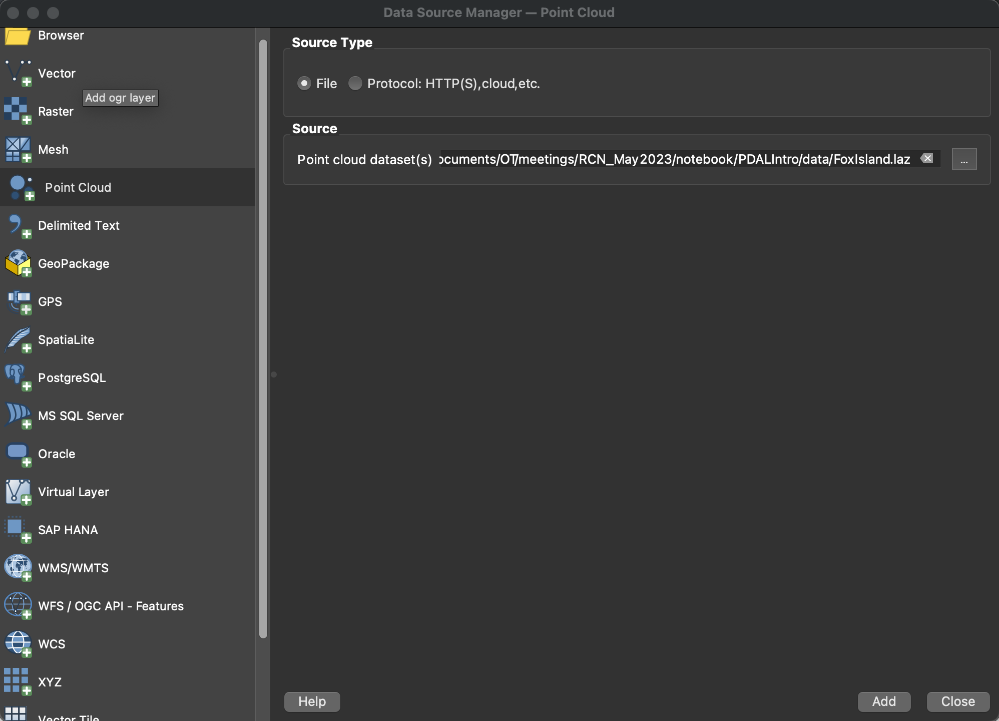

- QGIS will visualize the point classifications by default.  To visualize other parameters (e.g. "Z"), opent the properties for the point cloud layer.  Change the classification to "Attribute by Ramp", and change the attribute to "Z".

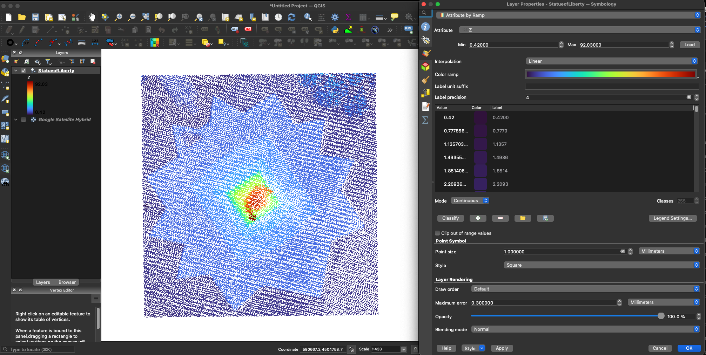

- Within the layer properties menu, the tab in the lower left will display basic statistics on each of the attributes:

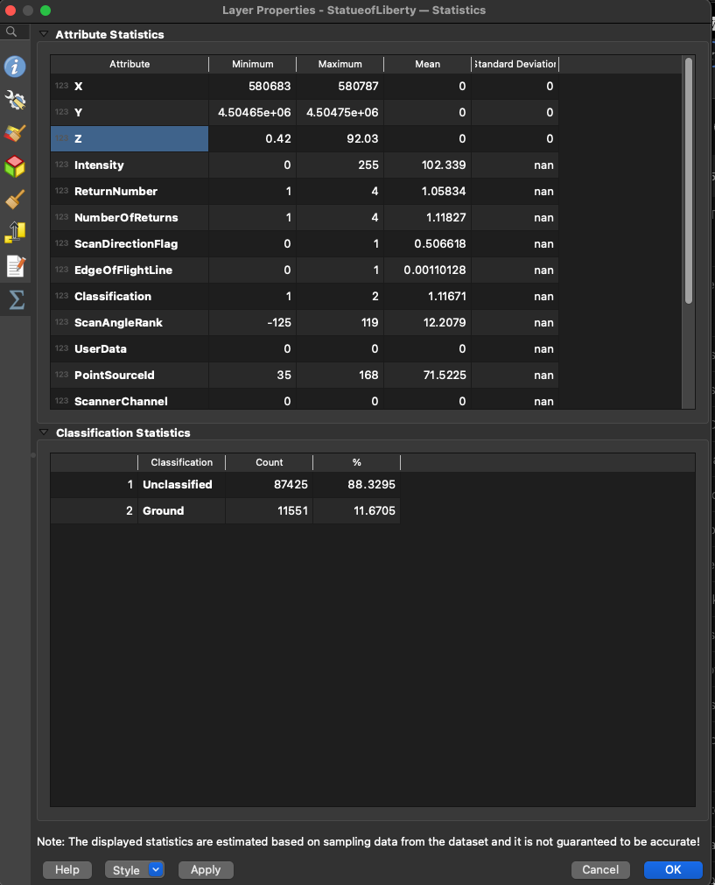

- To open the 3D viewer, select View --> 3D Map Views --> New 3D Map View.

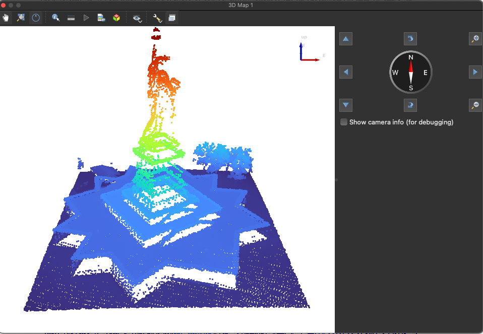

- 3D viewer has some basic tools baked in such as measurement, animations, exporting images, etc.


## Plas.io
- An alternative to QGIS for viewing point clouds is the website [Plas.io](https://plas.io/). [Plas.io](https://plas.io/) is a very useful, browser-based tool to visualize point clouds. The current version has one option that may be confusing and a bit unintuitive.  The default is to view all the points as intensity in greyscale.  To view other parameters, move the slider in "Intensity Blending" to the left ("ALL COLOR").

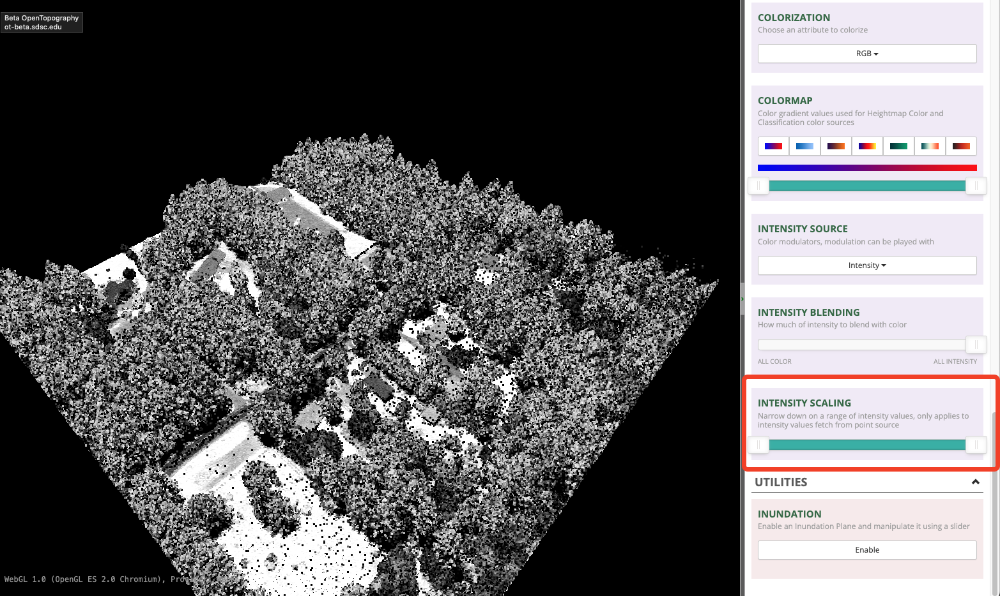


# Filtering<a name ="filter"></a>
- PDAL offers lots of different [filtering operations](https://pdal.io/en/2.5.3/stages/filters.html).

- Removing noise is a basic operation that is often used when working with lidar data.  Standard ASPRS classifications assign low point noise a value of 7, and high point noise a value of 18.  However, sometimes providers don't follow these conventions and may classify noise as a custom value.  For example, the USGS 3DEP data over Tacoma: [WA PierceCounty 1 2020](https://portal.opentopography.org/usgsDataset?dsid=WA_PierceCounty_1_2020) has noisy data with classifications of 135 and 146.  It is often useful to use the Potree 3D point cloud viewer in OpenTopography to visualize the point cloud.

Here is a snapshot of the data over the Tacoma Narrows Bridge in Washington:
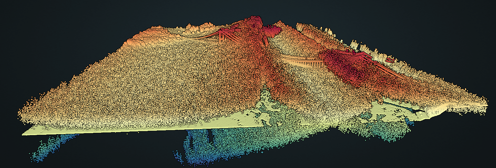

- Examining a small subset in a different region over nearby Fox Island still shows a LOT of noise:

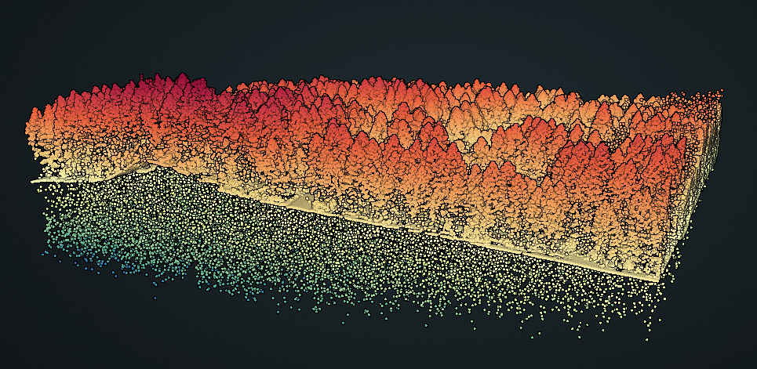

- We can first do a summary of the classifications, to see what we need to remove:

```
>> pdal info ./data/FoxIsland.laz --stats --filters.stats.dimensions=Classification  --filters.stats.count=Classification
{
  "file_size": 18337307,
  "filename": "FoxIsland.laz",
  "now": "2023-04-26T13:48:53-0600",
  "pdal_version": "2.5.3 (git-version: Release)",
  "reader": "readers.las",
  "stats":
  {
    "statistic":
    [
      {
        "average": 5.633072822,
        "count": 3100062,
        "counts":
        [
          "1.000000/2524244",
          "2.000000/474803",
          "135.000000/69015",
          "146.000000/32000"
        ],
        "maximum": 146,
        "minimum": 1,
        "name": "Classification",
        "position": 0,
        "stddev": 24.4020614,
        "variance": 595.4606004
      }
    ]
  }
}

```

- From this summary, we can see that we probably want to get rid of class 135 and 146. Create a new pipeline that will have stages to remove outliers, as well as remove points by classification and range.  For example:

```
{
    "pipeline": [
        "./data/FoxIsland.laz",
        {
            "type": "filters.outlier",
            "method": "statistical",
            "multiplier": 3,
            "mean_k": 8
        },
        {
            "type": "filters.range",
            "limits": "Classification![135:146],Z[-10:3000]"
        },
        {
            "type": "writers.las",
            "compression": "true",
            "filename":"./data/FoxIsland_Clean.laz"
        }
    ]
}
```

- The first stage of this pipeline is removing any statistical outliers by using the [filters.outlier](https://pdal.io/en/2.5.3/stages/filters.outlier.html). For this example, we are using the statistical filtering method to compute a mean distance from each point to its nearest neighbors and compare that with a global threshold value (calculated from the mean of all distances).  There are a variety of options to adjust the calculations of the threshold and other parameters.

- The second stage of the pipeline performs a range filter.  First it includes only classes that are **NOT (note the "!")** in the range of 135 - 146.  Then it include only elevation values in the range of -10 to 3000.  

- Run the pipeline and check the classifications:

```
>> pdal info FoxIsland_Clean.laz --stats --filters.stats.dimensions=Classification  --filters.stats.count=Classification
{
  "file_size": 18100550,
  "filename": "FoxIsland_Clean.laz",
  "now": "2023-04-26T14:07:52-0600",
  "pdal_version": "2.5.3 (git-version: Release)",
  "reader": "readers.las",
  "stats":
  {
    "statistic":
    [
      {
        "average": 1.303642411,
        "count": 3073184,
        "counts":
        [
          "1.000000/2522040",
          "2.000000/474743",
          "7.000000/76401"
        ],
        "maximum": 7,
        "minimum": 1,
        "name": "Classification",
        "position": 0,
        "stddev": 0.9783966857,
        "variance": 0.9572600745
      }
    ]
  }
}
```

- Now we have a low point class (class 7), that we didn't have in the original dataset.  This is because the outlier stage writes out values as noise that are not within its statistical threshold.  So, we need to modify our pipeline to now also remove low point noise.

- From ./pipelines/pipeNoiseFilter.json:
```
{
    "pipeline": [
        "./data/FoxIsland.laz",
        {
            "type": "filters.outlier",
            "method": "statistical",
            "multiplier": 3,
            "mean_k": 8
        },
        {
            "type": "filters.range",
            "limits": "Classification![135:146],Z[-10:3000]"
        },
	{
            "type": "filters.range",
            "limits": "Classification![7:7]"
        },	
        {
            "type": "writers.las",
            "compression": "true",
            "filename":"./data/FoxIsland_Clean.laz"
        }
    ]
}
```

- Removing the low point classification had to be added as a separate stage.  Initial attempts at doing the filtering in one stage (e.g. "limits": "Classification![135:146],Classification![7:7],Z[-10:3000]") were unsuccessful.  This may be a result of streaming mode and doing operations in memory. Adding the low point noise removal as a separate stage works fine, and now the details on the classifications show that only "ground" and "unassigned" are in the new data file: 

```
pdal info FoxIsland_Clean.laz --stats --filters.stats.dimensions=Classification  --filters.stats.count=Classification
{
  "file_size": 17452659,
  "filename": "FoxIsland_Clean.laz",
  "now": "2023-04-26T14:24:31-0600",
  "pdal_version": "2.5.3 (git-version: Release)",
  "reader": "readers.las",
  "stats":
  {
    "statistic":
    [
      {
        "average": 1.158417543,
        "count": 2996783,
        "counts":
        [
          "1.000000/2522040",
          "2.000000/474743"
        ],
        "maximum": 2,
        "minimum": 1,
        "name": "Classification",
        "position": 0,
        "stddev": 0.3651321262,
        "variance": 0.1333214696
      }
    ]
  }
}

```

- Here is our "clean" dataset.  Note how all the low noise has been removed

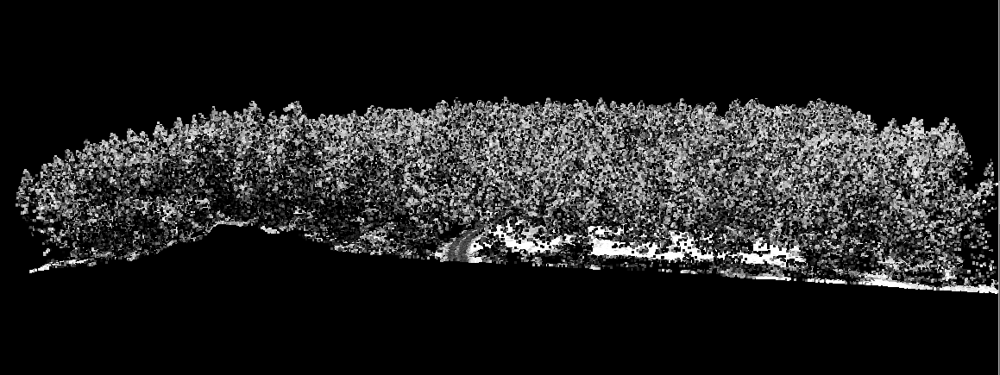


## Crop
- [filters.crop](https://pdal.io/en/2.5.3/stages/filters.crop.html#filters-crop) removes points that fall outside or inside a cropping bounding box. The "polygon" option takes a WKT-formatted string to apply the clipping mask.

- from ./pipelines/Clip_ex.json:
```
{
"pipeline": [{"type" : "readers.las",
              "filename": "./data/FoxIsland.laz"
             },
             {
              "type":"filters.crop",
              "polygon":"POLYGON(( 527459.360226284945384 5233060.30886838119477 , 527629.112309076474048 5233063.313330023549497 , 527621.100411363644525 5232994.711455857381225 , 527458.358739070827141 5233003.724840784445405 , 527459.360226284945384 5233060.30886838119477))"
             },
             {
              "type":"writers.las",
              "filename":"./data/FoxIsland_Clipped.laz"
             }
             ]}
```

- Using the "point" and "distance" parameters, users can also clip a buuffer around a specified point.  For more advanced use-cases of the clipping function, see https://pdal.io/en/2.5.3/tutorial/clipping/index.html#clipping
    

# Ground Classifications <a name ="ground"></a>
- compare using existing ground classifications vs calculating from scratch (i.e. assume a scenario where the data was provided without classifications)

- Extract only the ground classified points with the following pipeline (./pipelines/ExtractGround.json):

```
{
    "pipeline": [
        "./data/FoxIsland_Clean.laz",
        {
            "type": "filters.range",
            "limits": "Classification[2:2]"
        },
        {
            "type": "writers.las",
            "compression": "true",
            "filename":"./data/FoxIsland_Clean_GroundOnly.laz"
        }
    ]
}

>> pdal pipeline ./pipelines/ExtractGround.json
```

- Inspect the ground-only point cloud with [plas.io](https://plas.io/)
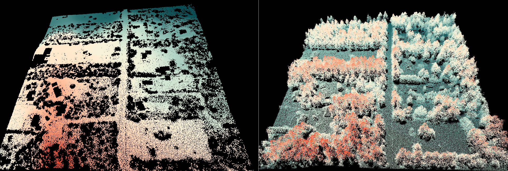
- Image on the left is the ground only point cloud vs the original dataset on the right

- In some cases we may receive a dataset that has very poor ground classification, or none at all.  In these scenarios it is probably best to re-calculate the ground surface.  Here is more complicated pipeline that demonstrates how to create a ground classification from scratch (./pipelines/CreateGround.json):

```
{
    "pipeline": [
        "./data/FoxIsland.laz",
	{
	    "type":"filters.assign",
	    "assignment":"Classification[:]=0"
	},
	{
	    "type":"filters.elm"
	},
        {
            "type": "filters.outlier",
            "method": "statistical",
            "multiplier": 3,
            "mean_k": 8
        },	
	{
	    "type":"filters.smrf",
	    "returns":"last,only",
	    "ignore":"Classification[7:7]"
	},
	{
	    "type":"filters.range",
	    "limits":"Classification[2:2]"
	},	
        {
            "type": "writers.las",
            "compression": "true",
            "filename":"./data/FoxIsland_CustomGround.laz"
        }
    ]
}

```

- In this pipeline we are starting with a lidar dataset that has all returns included (i.e. trees, buildings, etc), as well as containing a lot of noise.  The first stage of the pipeline sets all classification values to 0 (unclassified) to mimic the scenario of receiving a dataset without any classification values.  
- The second stage uses the [Extended Local Minimum (ELM) method](https://pdal.io/en/2.5.3/stages/filters.elm.html#filters-elm) to identify low noise points, and classify them as noise (class 7). 
- The third stage is using the [filters.outlier] filter to remove statistical outliers.  Outliers are set class 7.
- The fourth stage is using the [Simple Morphological Filter (SMRF)](https://pdal.io/en/2.5.3/stages/filters.smrf.html) to classify points as ground.  There are a couple of important options to set here.  Note instead of using a noise-free input dataset, we instead set the "ignore" option to ignore all values classified as noise.  For this pipeline, the filters.elm, and filters.outlier stages will have output noise values, so we don't want to include those. The other important option is the "returns" option.  When calculating a ground surface it might make sense to only use "last" returns.  However, this can lead to excessive filtering of data because of cases where there is only 1 return (e.g. return from a road).  As a result, it is best to set this parameter to: "returns":"last,only" which will take last returns where available, but also include points that are single returns.  This is the default setting for this parameter in PDAL. A comparison of outputs using "last" vs "last, only" is below.
- Finally, the last stage does a range filter, and only outputs points classified as ground (class 2).

- Here is a comparison of the ground only dataset using the vendor supplied classes (image on right) vs the "custom" ground classified dataset (image on left) we created from scratch using the SMRF filter:

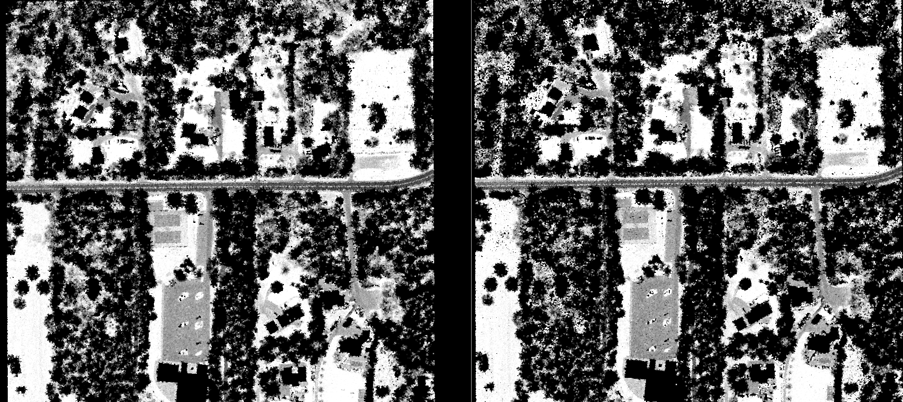

- Based purely on visual inspection, the SMRF filter does a decent job of creating a ground classified dataset.

- Here is a comparison of using the SMRF filter with only the "last" returns (image on left) vs using both the "last" and "only" returns (image on right).  Using only "last" returns can often filter out too much data:

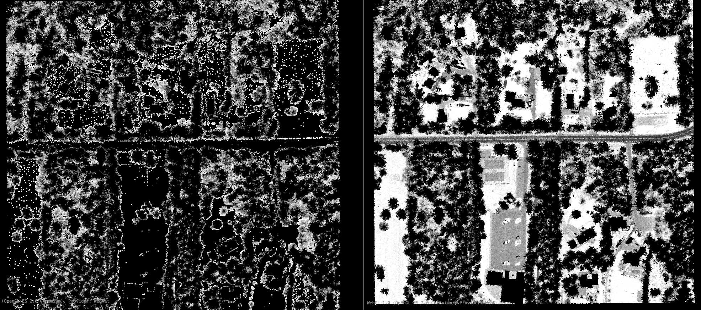


# Exercises<a name ="exercises"></a>
- Examine some of the sample LAS/LAZ datasets (or your own) in QGIS or [plas.io](https://plas.io/)
- For sample datasets: OR_WizardIsland.laz or FoxIsland.laz try to output a ground-only laz file
 


